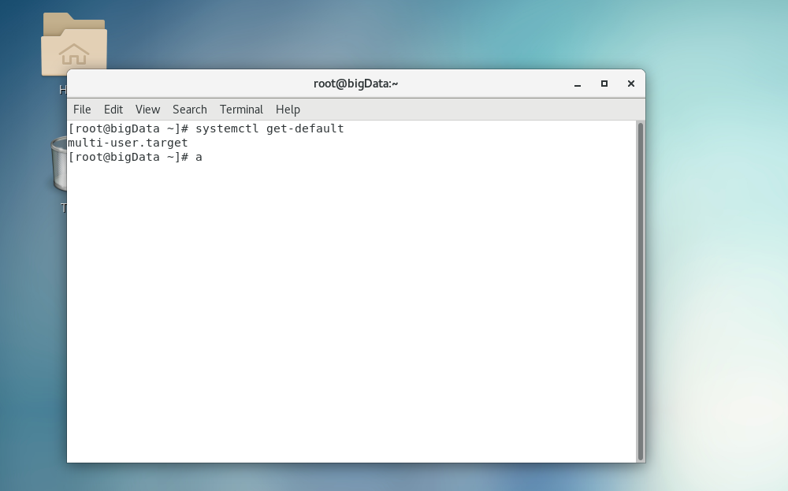

# 1 linux简介


# 2 Centos下载

## 网站

https://www.centos.org/

点击download->x86->ailiyun->.iso文件

http://mirrors.aliyun.com/centos/7.9.2009/isos/x86_64/


ctrl + alt + f1 进入图形化界面

ctrl + alt + f2 进入终端界面

# vim

## vim 替换

s/old/new/ # 替换一行第一个

s/old/new/g # 替换一行所有

g是global全局

%s/old/new/ # 替换全文每行第一个

%s/old/new/g # 替换全文所有


NAT (network address translation)模式  网络地址转换模式

# ip地址


# 服务

守护进程 daemon，服务和守护进程是一个概念


systemctl （control的简写ctl）


shutdown #默认1分钟后关键

shutdown -c #取消

shutdown now # 马上关机

shutdown 15:26 #定时关机

# 系统启动级别


## 查看系统运行级别

systemctl get-default

init 5 可以切换运行级别




## 修改系统启动级别

systemctl set-default xxx   #设置默认的运行级别为xxx

systemctl isolate multi-user.target    #更改为命令模式启动
systemctl isolate graphical.target     #更改为图形界面启动


# cd - 在两个目录之间跳转


# ln -s /root/xx  xx #软连接


# date

date +%s #时间戳

date -s “2017-02-21 21:22:11” # 设置时间


# sudo


文件位置/etc/sudoers，修改后才能执行sudo

root    ALL=(ALL)       ALL

#在下面添加一行

 username	ALL=(ALL)       ALL

​												NOPASSWD:ALL # 这样就不用输入密码


然后就可以用sudo 命令了


# 文件属性


硬链接可防止误删，inode，文件夹为里面的子文件数，.. 和 . 所有文件只是有两个数

# 查看文件大小

ls -lh

# tree 

tree可以看到子目录的信息，和ls用法一样

# du


# df disk free

df -h


# free -h 查看内存


# lsblk 查看挂载点


# 挂载

amount 

开机自动挂载 修改文件/etc/fstab，照抄上面就行


# 硬盘分区

## fdisk -l

## 添加硬盘（默认即可）


然后重启

## 会多一块硬盘

lsblk查看信息


fdisk -l 详细信息，还有路径显示


## 分区

fdisk /dev/sdb # /dev/sdb是设备名称

1 输入n 开始分区

2 p 默认主分区

3 输入回车或者1 默认

4 回车默认起始地址

5 回车默认结束

6 p 查看当前分区信息

7 w 保存退出


sdb的分区信息


查看分好的分区


格式化分区

mkfs -t xfs /dev/sdb1 # /dev/sdb1分区位置

分区后再查看


挂载到

mount /dev/sdb1 /home/atguigu/

查看


卸载分区

umont /dev/sdb1 # 或者/home/atguigu


killall sshd # 小心会导致连接不上

systemctl start sshd


# shell 编程

## 执行方式

sh xxx

./xxx.sh

source xxx

. xxx # 和上面source等价

1和2是再开一个子shell会影响变量的生效，环境变量的继承是有关系的。子shell设置的当前变量。父shell是不可见的

将hello.sh 放入到/bin/下面就可以直接使用 hello.sh来执行

## 变量

分为系统和用户自定义变量

* 全局和局部变量
  * 全局：bash和子bash有效
    * export xxx=11213 # 提升为全局变量，子bash的修改和export不会影响父bash的变量值
    * xxx=123 
    * export xxx
  * bash 打开子bash ，exit退出
* 局部：只对当前bash有效

env 查看所有环境变量

set 查看定义的变量，包括自己定义的

变量赋值不能有空格 name=mike

​	**有空格默认bash的命令 例如 ls -l**


* 查看变量是否是全局的用
  * env| grep xxx #在就是全局的
  * set| grep xxx #在就是局部的
* 撤销变量
  * unset xxx

### 只读变量

readonly aa=1

不能nuset只读变量

## 参数变量

* $# 变量个数

* $n 1-9表示输入的位置参数超过9用 ${10}

* $0 当前脚本名字
  * 常用于循环
* $*
  * 将所有的参数看成一个整体
* $@
  * 将所有的参数看成类似数组，可以遍历
* $?
  * 判断上次是否执行成功0表示成功

## 运算符

$((a+b))

$[$a+$b]

命令的结果值替换 $() 等价 ``

$[(a+b)*3]

## 判断条件

* test
  * test a = hello # 等号两边也要有空格
  * echo $? # 为真就是通过值为0，为假未通过值非0 
  
* 简写[ condition ] 一定要有空格
  * [ a = hello ]等号两边一定也有空格，否则就识别为1个值
  * [ xxx ] #非空字符串为0真，空值字符串为1假
  
* 数值条件判断
  * -lt 小于 
  * -gt 大于（greater then）
  * -eq 等于 （equal）
  * -ne 不等于（not equal）
  * -le 小于等于
  * -ge 大于等于
  
* 字符串条件判断

  * str1 = str2      检查[字符串](https://so.csdn.net/so/search?q=字符串&spm=1001.2101.3001.7020)1是否等于字符串2
  * == 和上面 = 等价
  * str1 ！= str2    检查字符串1是否不等于字符串2
  * str1 > str2       检查字符串1是否大于字符串2
  * str1 < str2      检查字符串1是否小于字符串2
  * -n str1         检查字符串的长度是否非0
  * -z str1         检查字符串的长度是否为0

* 判断文件权限

  * -x
  * -r
  * -w
  * test -r xx.sh
  * [ -r xxx.sh ]

* 判断文件类型
  * -e （existence） 存在
    * [ -e /root/xx.sh ]
  * -f 文件存在且是一个常规文件
  * -d 文件存在且是一个目录

* 逻辑判断
  * &&与

  * -a

  * || 或

  * -o

  * a=10

  * [ $a -gt 20 ] && echo "$a>20" || echo "$a<=20" # a>20输出a>20否则输出a<=20

    if [ $a -gt 10 ] && [ $a -lt 20 ];then echo "ok";fi

    if [ $a -gt 10  -a $a -lt 20 ];then echo "ok";fi

## 流程控制

* ### if判断

  ```shell
  # 写法一
  if [ conditio ];then
  	程序
  fi
  
  # 写法二
  if [ conditio ]
  then
  	程序
  fi
  
  # then相当于{}，因为是两条语句所以要用;隔开
  # 例如 cd /home/;ls -l 
  # [ condition ] 和上面的条件判断一样，也可以用test代替，test 等号也必须有空格
  # 为了防止错误，可以用 -lt , -eq 等
  ```

  * 例子 ，[ -n $1 ] 判断字符串是否为空

  ```shell
  #!/usr/bin/sh
  if [ "$1"x -eq "atguigu"x ] #[ $1 -eq atguigu ] 当没有传入参数时，空字符串这个会报错，用x来保证至少有值
  then
  	echo "hello,atguigu"
  fi
  ```

  

  if [ condifiton ]
  
  then
  
  ​	echo 'xxx'
  
  elif [ condifiton ]
  
  then
  
  ​	echo 'vbbb'
  
  else
  
  ​	echo 'xxxxx'
  
  fi
  
* ### case多分枝

```shell
case $变量名 in
"值1")
	程序1
;;
"值2")
	程序2
;;
...
*)
	都不满足的情况default程序
;;
esac

# ;; 类似于break
```

### for

写法一

```shell
for (( i=0;i<=10;i++))
do
	sum=$[ $sum + $i]
done
echo $sum

# (()) 在这里面可以用数学的运算符，而且在这里面不能用-lt
```

写法二（常用）

```shell
for 变量 in 值1 值2 值3...
do
	程序
done

# 测试
for os in linux windows mac ;do echo "$os"; done

#linux中{} 有特殊含义{1..10}从1到100 {1..100..2}步长为2
for i in {1..10} ;do echo "$i"; done
```

$* 和 $@区别

```shell
for i in $*
do 
	echo $i
done

for i in $@
do
	echo $i
done

# $* 和 $@ 在没有“”括起来前是没有区别,"$*"是一个整体 "$@"可以用数组遍历
```

### while

```shell
whlie [ condition ]
do
	程序
done

# 测试
i=0
while [ $i -le 100 ]
do
        #let sum+=i
        #let i++
        sum3=$[ $sum3 + $i ]
        i=$[ $i + 1 ]
done
echo $sum3
```

### read交互

```
read -t 5 -p "请输入你的名字: "name # 5秒后退出
echo "welcomne,$name"
```


### 函数

* 1 系统函数
  * basename 只要文件名
    * basename "str" .sh
      * basename 将字符串str 切掉只保留最后一个/的值，.sh 再切掉.sh只保留name
      * echo script name: $(basename $0 .sh )_log_$(date +%s)
  * dirname 只要目录名
    * 输入脚本所在绝对路径，放置../xx.sh 或者../../xx.sh
    * echo $(cd $(dirname $0) ;pwd)

* 2 用户自定义函数

  * 函数格式

    ```shell
    [ function ]funname[()]
    {
    	action
    	[return int;]
    }
    # [] 都可以省略
    # 经验1 函数必须先声明再使用
    # 经验2 函数返回值只能通过$?系统变量获得。可以显示加return返回。不加返回最后一条命令运行结果，return后面的范围0-255
    ```

    测试

    ```shell
    function add(){
    	echo "和为 $[ $1 + $2 ]"
    	# return $[ $1 + $2 ] 应为return只能返回0-255所以用命令替换来完成大于的返回
    	echo $[$1 + $2] # 或者通过赋值给全局变量
    
    }
    
    add $1 $2
    
    sum=`add $1 $2`
    ```

* exit 退出程序

### 正则表达式

* ^a
  * 以a开头
* bash$
  * 以bash结束
* ^$
  * 匹配开头和结尾
  * grep -n ^$ test.sh # 查看空行

* .
  * 表示一个任意字符
  * r..t #root就是
* *
  * 不单独使用，他和上一个字符连用，表示匹配上一个字符0次或多次
  * .*
    * ^a.*b$ #以a开头以b结尾的任意字符

* [a-z] [a,z,A-Z]
  * 可以用逗号隔开

* 匹配$，必须转义，必须单引号引起来\不用转义

  ```shell
  grep '\$' test.sh
  ```

* -E 支持扩展的花括号{} ?等,grep 不支持\d

  * grep -E

# 文本处理工具cut

* cut -d “ ”  -f 1,2,3 test.sh
  * 默认\t为分隔符
  * f 1-4 #1-4列
  * f 6- #6到最后
  * f -4 #四列之前

# shell 进阶

## shell是弱类型语言，变量默认为字符串

!1000 执行历史id为1000的命令

${name} 是 $name的完整完整写法

my$(name}is

* pstree 查看进程关系


```shell
[ $# -ne 2 ]&&{
	echo "必须是两个参数"
	exit 119 #返回状态码119 $?就是119
}
echo "就是2个参数"
```

$!获取上一个在后台执行的pid

nohup ping www.baidu.com >> /dev/null 2>&1 &

nohup ping www.baidu.com > /dev/null 2>&1 &

$$ 获取当前脚本执行的id

$_ 获取上传传入的最后一个参数

## 内置命令

echo

```shell
-n 不换行
-e 解析特殊字符符号
	\t 4个空格 \r 回车 \n  \b 退一格
```

printf

```
printf "\t你好\r\n" #自动识别特殊符号
```

eval

```
#执行多个命令,将指令做为参数传递
eval ls;cd /tmp
```

exec

不创建子进程，执行后续命令，且执行完毕后自动退出

```
执行完命令并exit退出
exec date
```


## shell 子串用法（重要2星）


## 统计时间

```shel
`time for i in {1..1000} ; do  char=`seq -s "chao" 1000`;echo ${#char} >> /dev/null;  done

#不要留空格 &>/dev/null 挂后台运行

time for i in {1..1000} ; do  char=`seq -s "chao" 1000`;echo ${#char} &>/dev/null;  done

# wc -L 统计最长的行数
```

## 字符串使用

```she
name2='abcABC22c'
echo ${name2#a*c} #从头到尾删除最短的
echo ${name2##a*c} #从头到尾删除最长的的

%%和%类似
```

测试

```shell
# 创建文件
touch a{1..10}_log_final_.jpg

## 修改文件名，删除_final后缀
for i in $(ls | grep ^a);do mv $i ${i%_final}; done

# 下面这个替换好点。上面限制死了，必须是_final结尾，不能是中间的
for i in $(ls | grep ^a);do mv $i ${i//_final_/}; done
```

## shell扩展变量(3星)


```sh
# :-
#不会改变原来的值,会将值返回result
result=${name:-"默认值"}

# :=
#会改变原来的值,会将值返回result
result=${name:="默认值并且改变name值"}

# :？
#不会改变原来的值,会将值返回result，标准错误stderr 2
result=${name:?"空值时的错误信息"} # stderr 2 stdout 1 

# :+
#不会改变原来的值,非空会返回后面的
result=${name:+"非空时返回"}
```

测试

```sh
# 删除指定目录下的文件,防止dir_path没有赋值的情况
find ${dir_path:='/data/mysql/back_data/'} -name "*.tar.gz" -type f -mtime +7|xargs rm -rf
```

## 为什么学习子shell


## 创建进程列表

```shell
# 在小括号里的就是进程列表
# 加上小括号就是开启子shell运行命令
(cd /var;ls -l;pwd ;cd /tmp; pwd)
```

$BASH_SUBSHELL

0就是非子shell 非0 就是子shell

### 子shell嵌套

经常用子shell进行多线程处理。提高程序并发效率

```shell
一个小括号就是一个子shell，3层子shell
(cd ~;(pwd;(echo $BASH_SUBSHELL)))
```

## 内置命令和外置命令

内置命令：系统启动时就加入到内存中，常驻内存。执行效率高，但占用资源

外置命令：系统需要从硬盘中读取程序文件，再读入到内存加载，自己单独下载的，处于bash shell 之外的程序


外置命令特点：一定会开启子进程

type 来验证


内置命令不会产生子shell。

内置名和shell是为一体的，是shell的一部分。不需要单独去读取某个文件。系统启动后。就执行在内存中了

compgen -b #查看内置命令

## shell 脚本开发

判断用户输入是否为纯数字

 ```shell
 #!/usr/bin/sh
 
 # 用户输入数值运算
 prin_usr(){
         return 1
 }
 
 # 判断用户输入是否是数字
 read -t 8 -p "please input number: " number1
 
 # 先判断输入不为空，然后再替换输入的所有数字后必须为空
 if [ -n "$number1" -a -z "${number1//[0-9]/}" ]; then
         echo "是纯数字"
 else
         echo "输入为空或者不是纯数字"
 fi
 sed 's/old/new/'  #第一词出现的
 sed 's/old/new/g' #全部
 ```

## 找到文件后缀

```shell
name=123.jpg
echo ${name##*.}

echo ${name%.*}
```

## bc 计算小数

```
echo "1.1*2"|bc
```

### tr 命令替换

``` 
echo {1..10}| tr " " "+"
seq -s "+" 100 | bc 
```

